## About

OpenCiv1 project is an open source rewrite of <a href="https://en.wikipedia.org/wiki/Civilization_(video_game)">Civilization game</a> designed by Sid Meier and Bruce Shelley in year 1991.

<ul>
<li>The OpenCiv1 uses .NET 8 and Avalonia UI framework and is OS independent. It is currently compatible with desktops: Windows, Linux and MacOSX.</li>

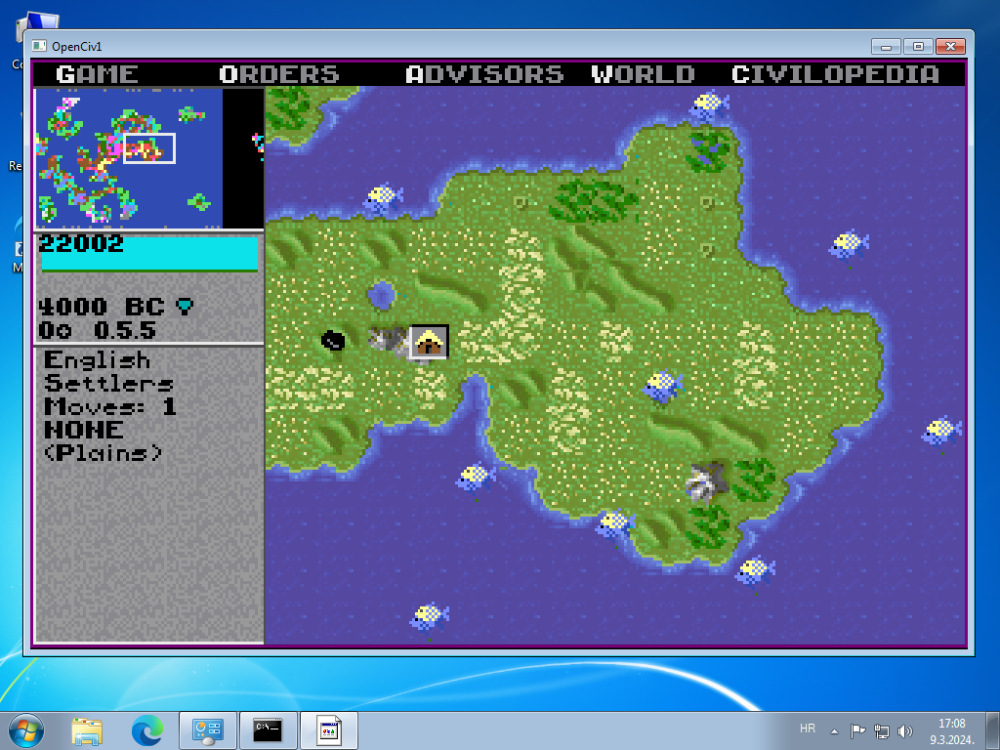
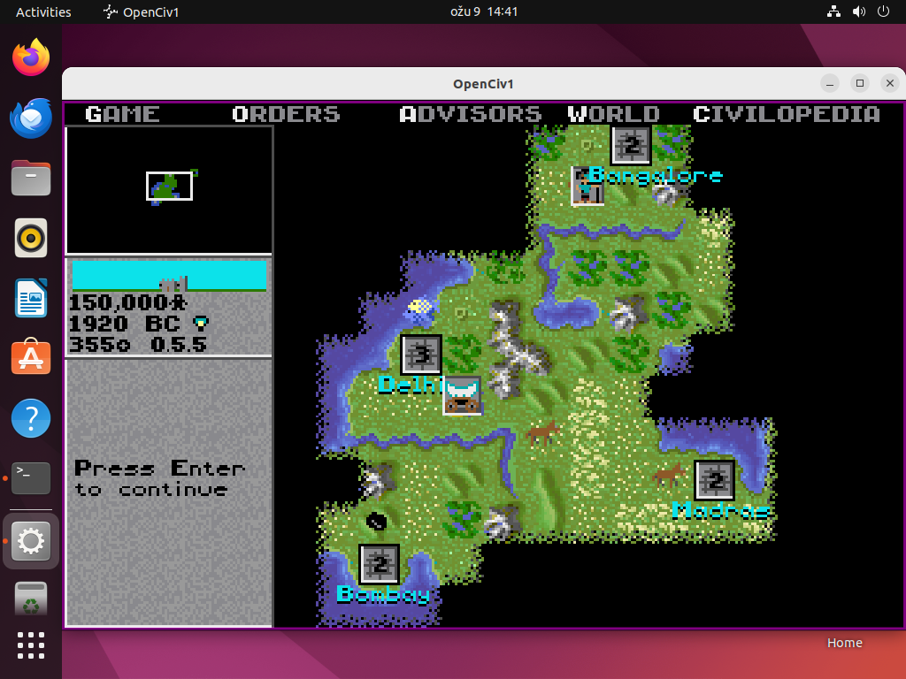
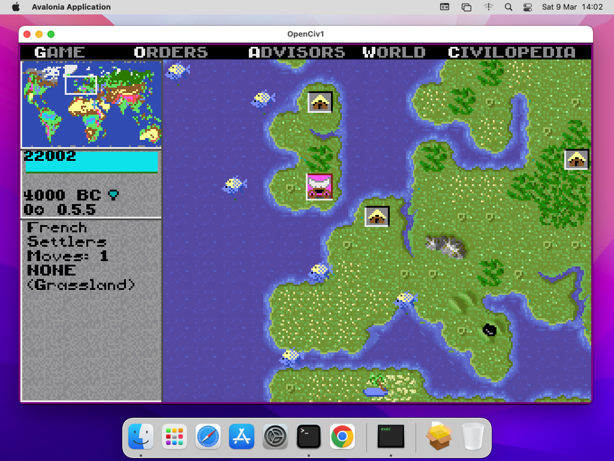

<li>The game logic is <b>Based on original DOS Civilization game version 475.05</b> disassembly.</li>
<li>The game is still very popular and easy to play. But the obsoletness of DOS or Windows 16-bit platform and the bugs that have never been fixed are hindering the popularity of the game.</li>
<li>The news, discussions about this project and releases are published regularly on <a href="https://forums.civfanatics.com/threads/rewrite-of-civilization-1-source-code-openciv1-project.682623/" target="_blank">Civilization Fanatics Forum page</a></li>
</ul>

## Copyright considerations

<b>The available code is not a full working copy of the game.</b> <b>To run OpenCiv1 you are legally required to own your own copy of the DOS Civilization game.</b> 
<b>This is the reason that not a single file from the original game is included in this GitHub repository as they are copyrighted.</b>

The part of the game assembly code is emulated with Virtual CPU, and the rest of the code has been rewritten from scratch until all of the code is replaced with new copyright free code. The other resources (like graphics, music and text) will also be completely replaced with copyright free resources before publishing the complete game.

## Dependencies
<ul>
<li>.NET 8</li>
<li>Visual C++ 2015-2019 redistributable (on some Windows machines)</li>
</ul>

## How to install release version of OpenCiv1

The files from the Release should be copied directly into installed and working DOS Civilization game directory.

## How to compile the code (.NET 8 SDK required)
If you want to compile the code, it is assumed that:
<ul>
<li>You are using Visual Studio 2022 (or equivalent).</li>
<li>For debugging you have installed DOS Civilization game at 'c:\Dos\Civ1\', or at '~/Dos/Civ1/' if you are using Linux (uppercase files!).
It is where its home directory resides (Images, palettes, text and save games are loaded/saved there, for now).</li>
<li>For Release mode it is expected that OpenCiv1 and it's dependencies (for simlicity) are put directly into directory with resource files, 
for example: 'c:\Dos\Civ1\', '~/Dos/Civ1/' or any other path.</li>
</ul>
Compile with CLI method:
<ul>
<li>git clone https://github.com/rajko-horvat/OpenCiv1 (To clone a specific branch use: git clone -b [branch] https://github.com/rajko-horvat/OpenCiv1)</li>
<li>cd OpenCiv1</li>
<li>dotnet build -c Release</li>
</ul>

## Current status

<b>The game is in working state</b>, but you have to legally own the Original game (the .txt, .pic and .pal files have to be present).  
Keyboard shortcuts:
<ul>
<li>Alt + D - Enable / Disable the <b>Debug mode (Shift-56)</b></li>
<li>Alt + P - Pause / Resume game</li>
<li>Alt + 1 - Show / Hide Screen 1</li>
<li>Alt + 2 - Show / Hide Screen 2</li>
<li>Alt + 3 - Show / Hide Screen 3</li>
</ul>

## Help needed

All contributions are welcome.

For this stage of code rewrite, the programmings skills needed are:
<ul>
<li>Moderate knowledge of assembly language,</li>
<li>Knowledge of C# language.</li>
<li>For details see: https://github.com/rajko-horvat/OpenCiv1/wiki/Introduction-to-code-translating</li>
</ul>

## Project milestones

The goal is to completely rewrite the code (first stage), fix the bugs and port the code to a modern platform (second stage).

### Milestones for a first stage
<ul>
<li>Reaching the initial playability of the game (passed),</li>
<li>Rewrite of the game code, functionalities and features (in progress...),</li>
<li>Archive the game code.</li>
</ul>

### Planned milestones for a second stage
<b>What will change in the new version:</b>
<ul>
<li>Porting to HTML5 platform (Web interface, online gaming),</li>
<li>Graphics (the new graphics will be as close as possible to the spirit of the original version),</li>
<li>Music/Sounds (the new music/sounds will be as close as possible to the spirit of the original version),</li>
<li>Some text where appropriate,</li>
<li>Design (Map zoom functionality, some small updates, also some dialogs will be slightly different),</li>
<li>Multilanguage capability,</li>
<li>Multiplayer capability,</li>
<li>Cheat capability,</li>
<li>Plugin capability (can override rules, graphics and music/sounds).</li>
</ul>
<b>What will stay the same:</b>
<ul>
<li>Original game rules and logic (except for established bugs),</li>
<li>Overall look and feel of the original game.</li>
</ul>

## Screenshots of the OpenCiv1 game

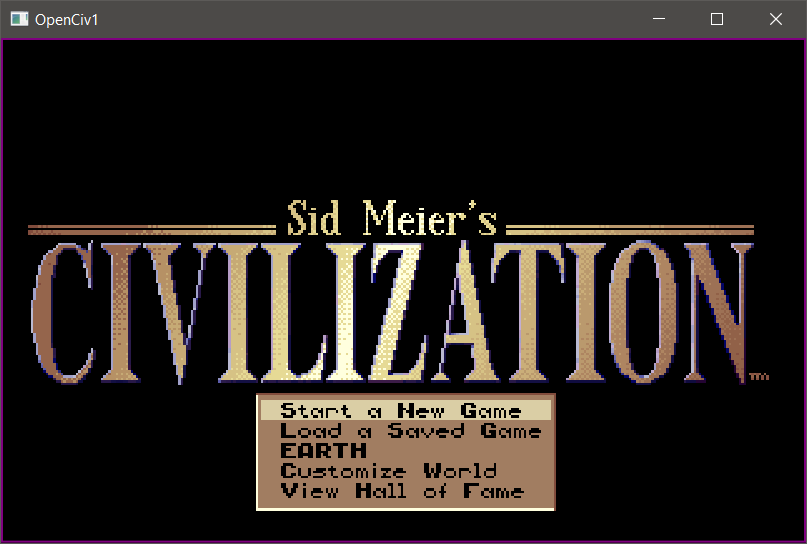
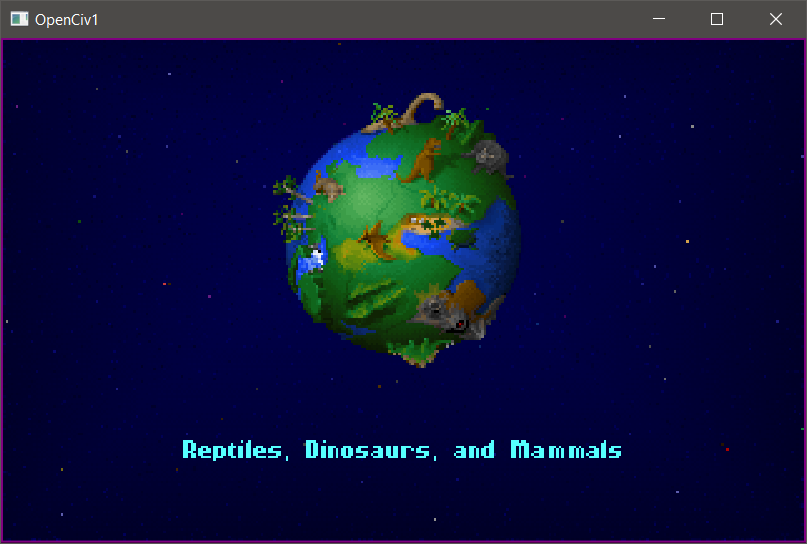
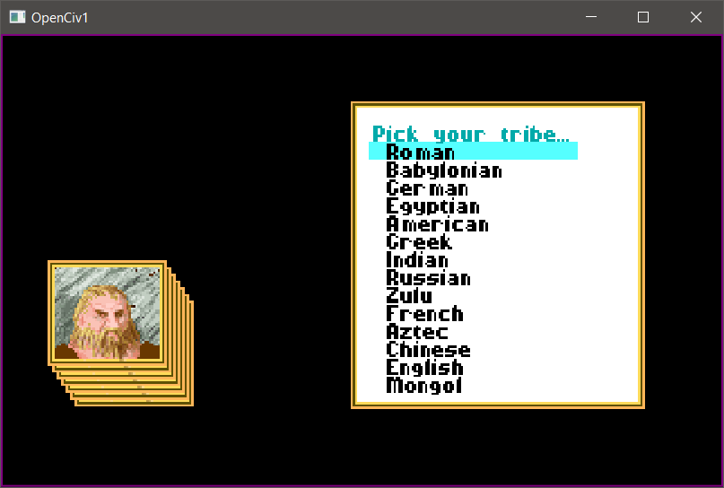
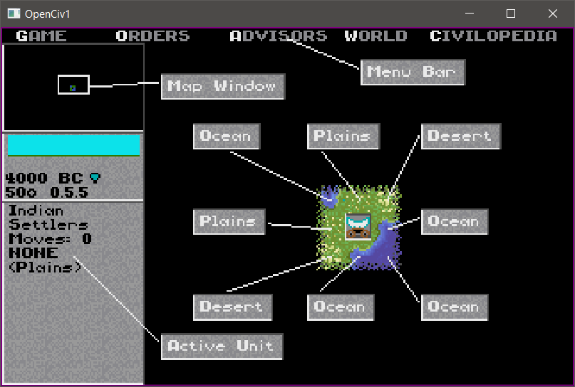
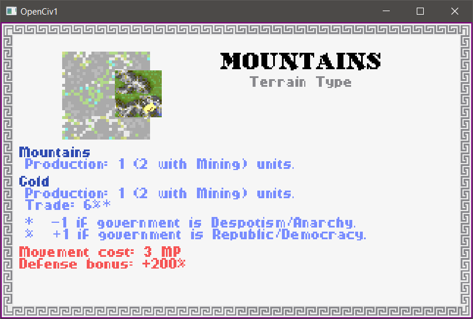
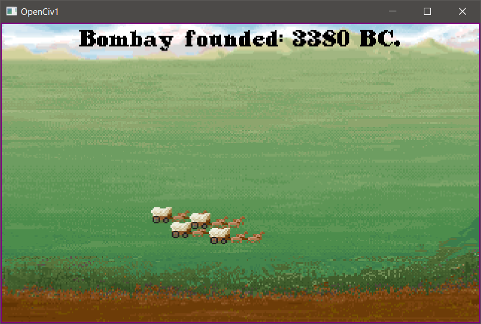
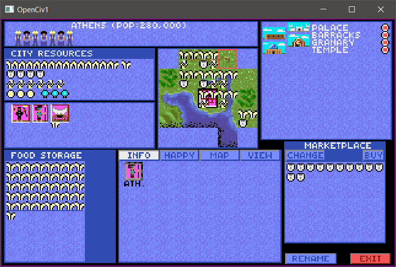

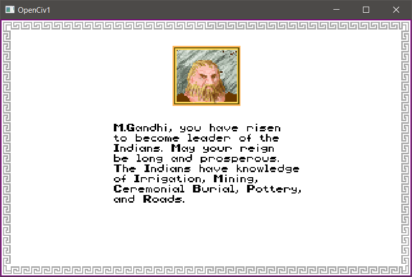
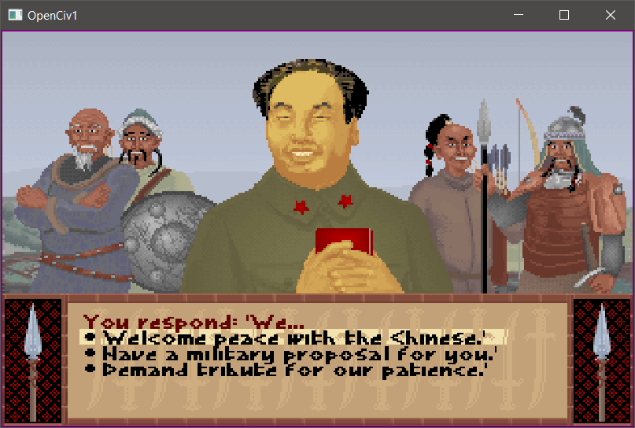
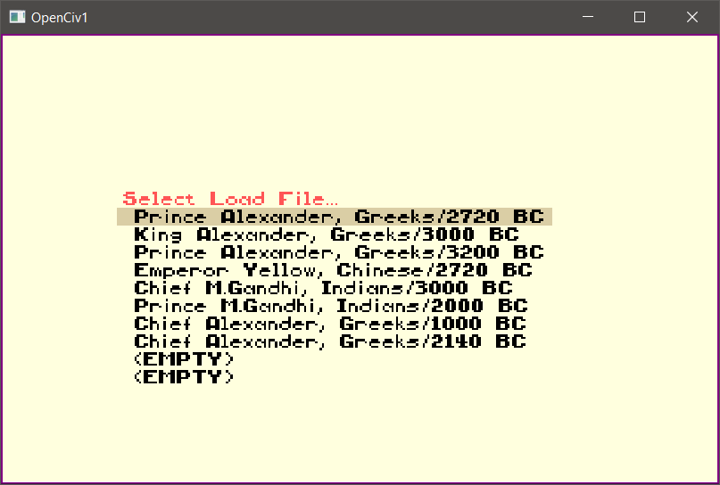
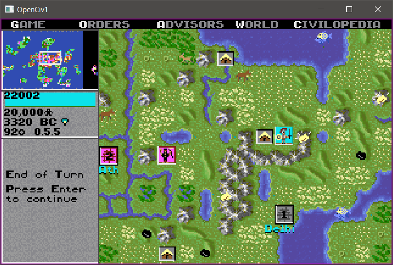
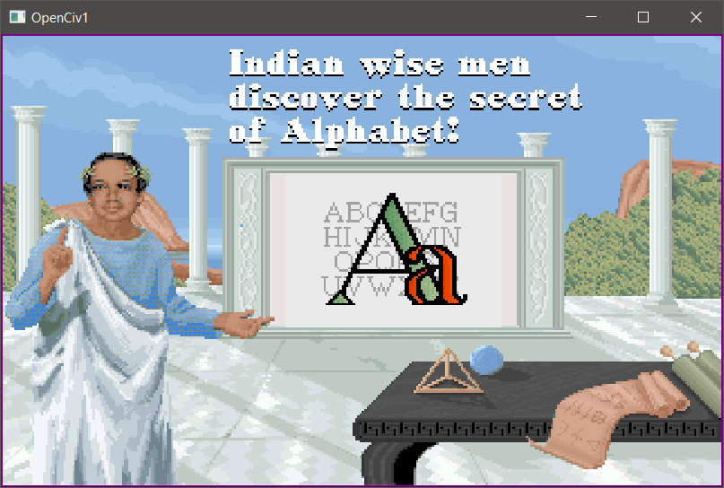
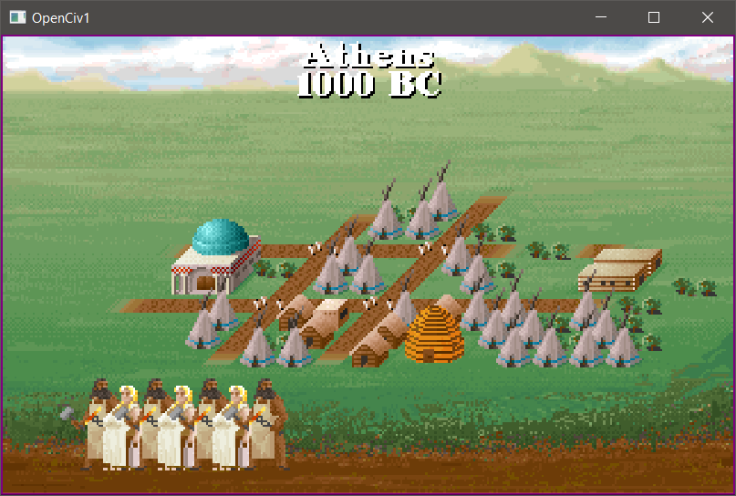

