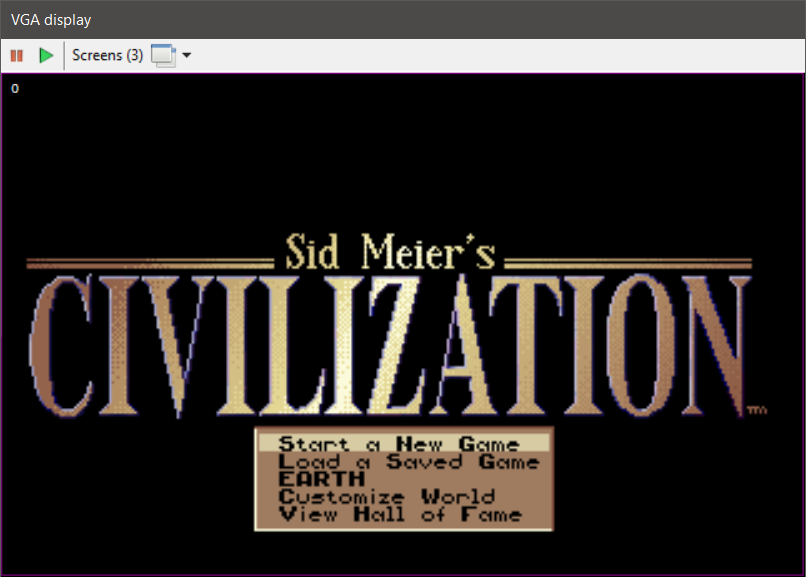
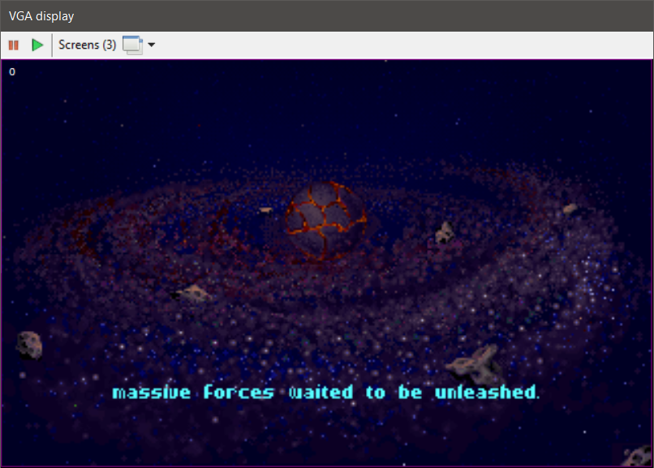
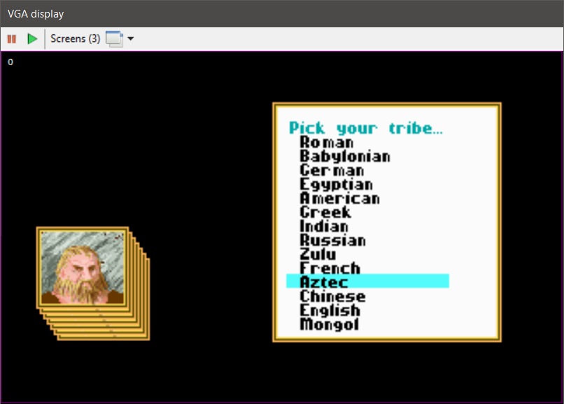
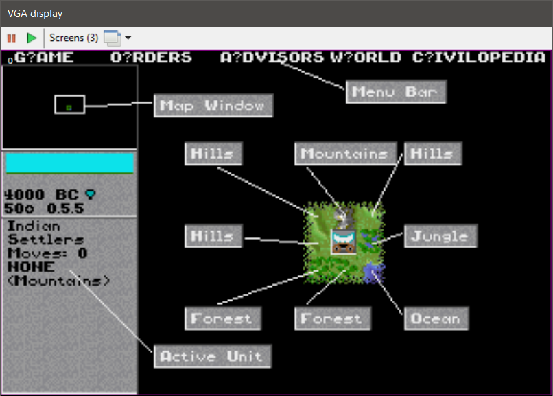
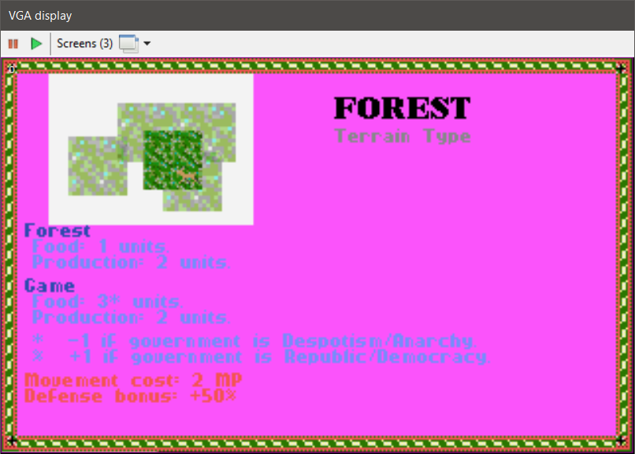
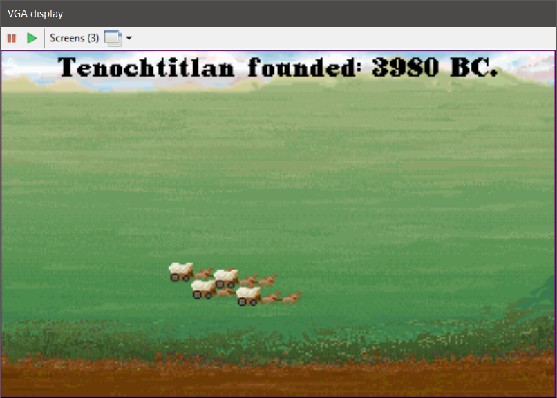
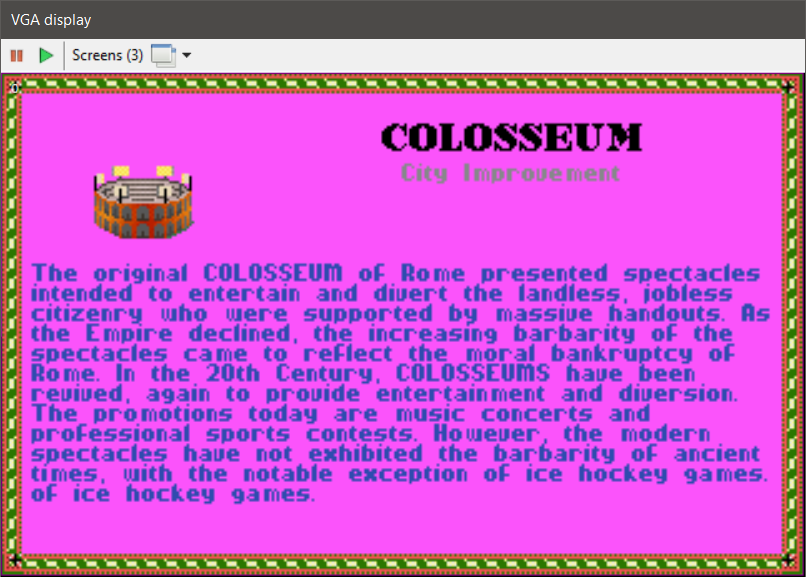
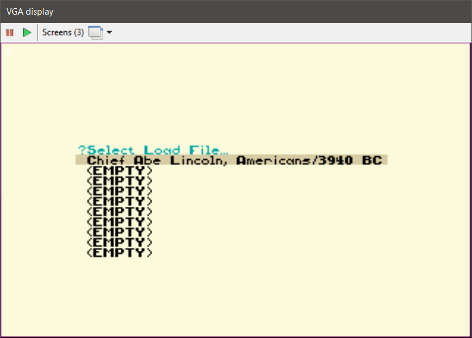
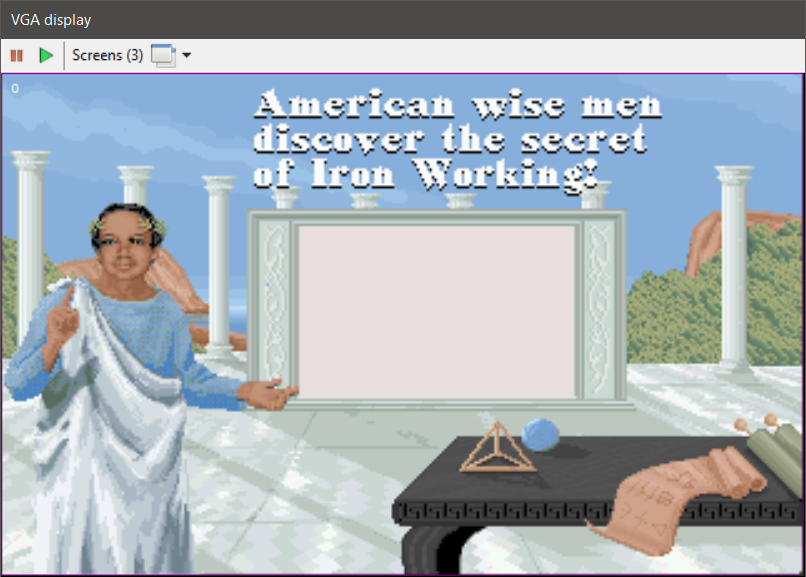

## Repository description

This is a rewrite of Civilization 1 Game Source Code designed by Sid Meier and Bruce Shelley in year 1991.

The code logic is <b>Based on original DOS CIV I version 475.05</b> disassembly.

The game is still very popular and easy to play. But the obsoletness of DOS or Windows 16-bit platform 
and the bugs that have never been fixed are hindering the popularity of the game.

## Current status

<b>The game is in working state</b>, but requires Original game files (.txt, .pic and .pal) to be present.
The <b>Debug mode</b> can be toggled by pressing Alt + D Key.

## Running the code
If you want to compile the code, it is assumed that:
<ul>
<li>You are using Visual Studio 2022.</li>
<li>You have .NET Framework 4.8 installed.</li>
<li>You have installed DOS CIV I game at 'c:\Dos\Civ1\', or at '~/Doc/Civ1/' if you are using Mono on Linux.
It's where it's home directory resides (Images, palettes, text and save games are loaded/saved there, for now).</li>
</ul>

## Help needed

All contributions are welcome.

For this stage of code rewrite, the programmings skills needed are:
<ul>
<li>Moderate knowledge of assembly language,</li>
<li>Knowledge of C# language.</li>
<li>For details see: https://github.com/rajko-horvat/OpenCiv1/wiki/Introduction-to-code-translating</li>
</ul>

## Project milestones

The goal is to completely rewrite the code (first stage), fix the bugs and port the code to a modern platform (second stage).

<b>Milestones for a first stage are:</b>
<ul>
<li>Reaching the initial playability of the game (passed),</li>
<li>Rewrite of the original code, functionalities and features (in progress...),</li>
<li>Archive the original code.</li>
</ul> 
<b>Planned milestones for a second stage are:</b>
<ul>
<li>Fixing the bugs and introduction of new features 
(Multiple languages besides basic English, Multiplayer capabilities, and a lot more...),</li>
<li>Porting to HTML5 platform,</li>
<li>Redesigning graphics and music.</li>
</ul>

## Screenshots of the Open Civilization 1 game

 
 
 
 
 
 
 
 
 
 
 
 
 

