## About

OpenCiv1 project is an open source preservation effort and rewrite of the iconic <a href="https://en.wikipedia.org/wiki/Civilization_(video_game)" target="_blank">Civilization game</a> designed by Sid Meier and Bruce Shelley in year 1991.

If you like games, and want to preserve our gaming heritage, please support: <a href="https://www.stopkillinggames.com/en" target="_blank">The Stop Killing Games Campaign</a>

<b>The final source code for the game, according to the sources from MicroProse Software, Inc. is lost forever.</b> The only copy that remains is the game prototype source code on Sid Meier's own IBM PC on which he designed the game (<a href="https://www.youtube.com/watch?v=XwUM33VJRbY" target="_blank">Video in which Sid Meier talks about his IBM PCs</a>).
<ul>
<li>The OpenCiv1 uses .NET 8 and Avalonia UI framework and is OS independent. It is currently compatible with desktops: Windows, Linux and MacOSX.</li>

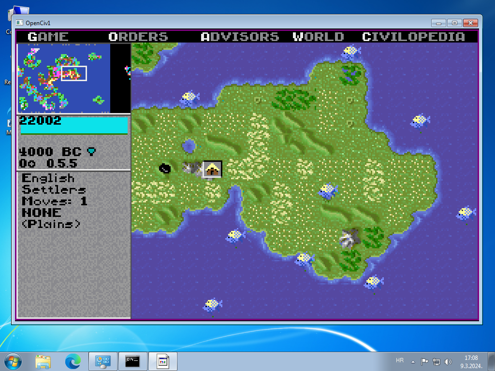
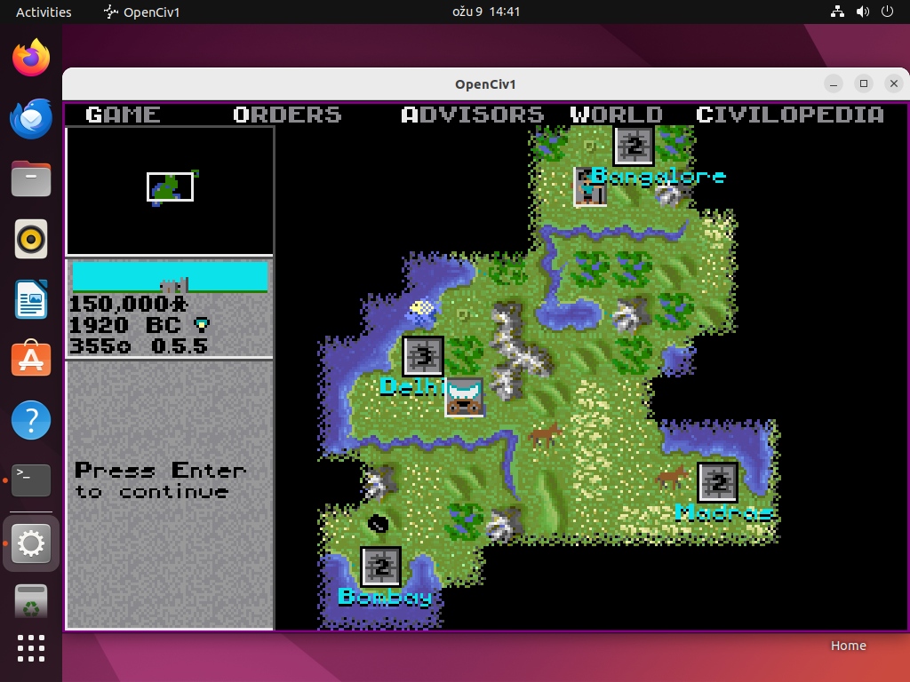
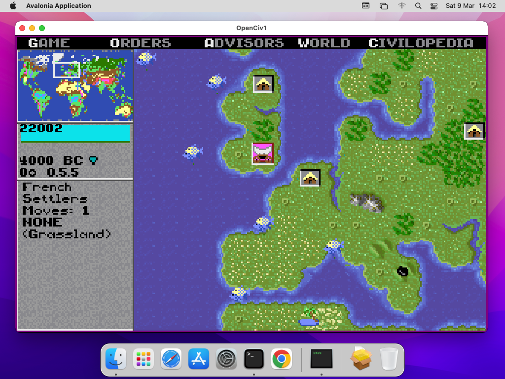

<li>The game logic is <b>Based on Original 1991 DOS Civilization game version 475.05</b>.</li>
<li>The game is still very popular and easy to play. But the obsolescence of DOS or Windows 16-bit platform and the bugs that have never been fixed are hindering the popularity of the game. <a href="https://forums.civfanatics.com/threads/dos-civilization-1-1991-bug-s-discussion-what-should-be-fixed-in-openciv1.688773/" target="_blank">Original game bug(s) discussion page</a></li>
<li>The news, discussions about this project and release news are published regularly on <a href="https://forums.civfanatics.com/threads/rewrite-of-civilization-1-source-code-openciv1-project.682623/" target="_blank">Civilization Fanatics Forum page</a></li>
<li>For contact purposes openciv1@yahoo.com public email address can be used.</li>
</ul>

## Project reviews
<ul>
<li><a href="https://gigazine.net/gsc_news/en/20240129-openciv1/" target="_blank">OpenCiv1 is a project that disassembles the first 'Civilization' and makes it open source, by logu_ii (from Jan 29, 2024)</a></li>
<li><a href="https://thepixelspulse.com/posts/openciv1-rewrite-modernizing-civilization-1/" target="_blank">OpenCiv1 Rewrite: A Blueprint for Modernizing Civilization 1, by gaming-insider (from March 28, 2026)</a></li>
</ul>

## Copyright considerations

The sole purpose of this preservation project is to provide an Open source code and resources to the game which is considered abandoned for at least 30 years since in that time the publishing company and/or its successor(s) that released the original game did not provide any updates or support and the successor publishing company is not selling that particular game for a least 20 years.

What this project will not do:
<ul>
<li>Copy any of the original game source code or it's executable code,</li>
<li>Copy any of it's copyrighted assets (graphics, music, etc.),</li>
<li>Copy or use any of the protected trademarks,</li>
<li>Associate itself in any way with any of the companies that sell games.</li>
</ul>

<b>The available source code and resources are not a full working copy of the game.</b>
<b>To run OpenCiv1 you are legally required to own your own copy of the Original game.</b>
<b>This is the reason that not a single file from the Original game is included in this GitHub repository as they are copyrighted.</b>

## Current status

<b>The game is in working state</b>, but you have to legally own the Original game (the .txt, .pic and .pal files have to be present).

The part of the game assembly code is emulated with Virtual CPU, and the rest of the code has been rewritten from scratch until all of the code is replaced with new copyright free code. 
The other resources (like graphics, music and text) will also be completely replaced with copyright free resources before publishing the complete game.

## How to Contribute to this project

Anyone can contribute to this repository in accordance with these <a href="https://github.com/rajko-horvat/OpenCiv1/blob/master/.github/CONTRIBUTING.md">Contributing guidelines</a>

Currently, you can contribute to this repository in one of the following ways:
<ul>
<li>By testing the game functionality and submitting Issues,</li>
<li>By rewriting the part(s) of the code from pseudo assembly language to native C# language,</li>
<li>By designing parts of a 'Default' Visual and Audio theme (which must preserve Original game appearance and feel as much as possible, SVG and MIDI/SoundFonts would be the best),</li>
<li>By designing parts of a 'Custom' Visual and Audio theme(s) (SVG and MIDI/SoundFonts would be the best).</li>
</ul>

## Frequently asked questions

<b>Q:</b> Why did you use C#, instead of C and x86 assembly in which the Original game is written?

<b>A:</b> I have chosen C# because it's platform independent, secure, flexible, managed, popular, modern and API rich language.

***

<b>Q:</b> Why does the OpenCiv1 differs, in some aspects, from the Original game?

<b>A:</b> There are numerous reasons:
<ul>
<li>Simply replicating all of the functionality to skip the DOSBox emulation to be able to run the game is not a good enough reason (for me) to start a project of this magnitude.</li>
<li>Copying the game Code, Functionality, Graphics and Audio would be considered a Copyright violation and that is prohibited by current Copyright laws.</li>
<li>To make the OpenCiv1 available to anyone who wishes to play the game, and that means Copyright free Code, Graphics and Audio.</li>
<li>To add additional functionalities (features) to the game (like online gaming, scalable HQ Graphics, HQ Audio, plugins, etc.).</li>
<li>To make OpenCiv1 platform independent, popular, appealing and easy to play, to the older, as well as to the younger public, as was Original game popular back in the day.</li>
</ul>

***

<b>Q:</b> Will OpenCiv1 source code be identical to the Original game source code?

<b>A:</b> No. The OpenCiv1 source code does not contain any of the original source code. 
The rewritten code performs the same function (as the original code does), but the code is completely different and under MIT license. 
MicroProse and its successors never released the original source code which remains protected under copyright laws to this day.

***

<b>Q:</b> Does that mean that the OpenCiv1 will be completely different from Original game, like, for example FreeCiv?

<b>A:</b> Absolutely not, the goal is to keep all of the original rules and functionalities, as well as much as possible of the original Visual and Audio appearance.

***

<b>Q:</b> You know that Civilization 7 will be published soon, doesn't that make First Civilization game in the series completely obsolete?

<b>A:</b> Based on some stats, many people think that the first Civilization offers as much fun as the other sequels do.

***

<b>Q:</b> Are there any additional or different keyboard shortcuts (apart from the default ones)?

<b>A:</b> Yes, these are additional keyboard shortcuts that you can use during the game:
<ul>
<li>Alt + D - Enable / Disable the <b>Debug mode</b> (previously, Shift-56)</li>
<li>Alt + P - Pause / Resume game</li>
<li>Alt + 1 - Show / Hide Screen 1</li>
<li>Alt + 2 - Show / Hide Screen 2</li>
<li>Alt + 3 - Show / Hide Screen 3</li>
<li>You can't scroll the map with Shift + NumPad keys, instead use Shift + Navigation Keys (Up, Down, Left, Right, Home, End, PageUp and PageDown)</li>
</ul>

## Dependencies
<ul>
<li>.NET Core 8</li>
<li>Visual C++ 2015-2019 redistributable (on some Windows machines)</li>
</ul>

## How to run the release version of OpenCiv1

The files from the Release should be copied directly into installed and working Original game directory. The game can be run by running the OpenCiv1 executable.

## How to compile the code (.NET Core 8 SDK required)
If you want to Debug (or Compile) the code with Visual Studio 2022 Community Edition, it is assumed that:
<ul>
<li>For debugging purposes you have installed Original game at 'c:\Dos\Civ1\', or at '~/Dos/Civ1/' if you are using Linux (be careful of uppercase files!).
It is where its home directory resides (Images, palettes, text and save games are loaded/saved there, for now).</li>
</ul>
You can also compile with CLI method:
<ul>
<li>git clone https://github.com/rajko-horvat/OpenCiv1 (To clone a specific branch use: git clone -b [branch] https://github.com/rajko-horvat/OpenCiv1)</li>
<li>cd OpenCiv1</li>
<li>dotnet build -c Debug</li>
</ul>

## Project milestones

The goal is to completely rewrite the code (first stage), fix the bugs and port the code to a modern platform (second stage).

### Milestones for a first stage
<ul>
<li>Reaching the initial playability of the game (passed),</li>
<li>Rewrite of the game code, functionalities and features (in progress...),</li>
<li>Archive the game code.</li>
</ul>

### Planned milestones for a second stage
<b>What will change in the new version:</b>
<ul>
<li>Porting to Razor platform (Web interface, online gaming),</li>
<li>HQ Graphics (the new graphics will be as close as possible to the spirit of the original version),</li>
<li>HQ Audio (the new Audio will be as close as possible to the spirit of the original version),</li>
<li>Some text where appropriate,</li>
<li>Design (Map zoom functionality, some small updates, also some dialogues will be slightly different),</li>
<li>Multilanguage capability,</li>
<li>Multiplayer capability,</li>
<li>Cheat capability,</li>
<li>Plugin capability (can override rules, graphics and music/sounds).</li>
</ul>
<b>What will stay the same:</b>
<ul>
<li>Game rules and logic (except for established bugs),</li>
<li>Overall look and feel of the game.</li>
</ul>

## Current screenshots of the OpenCiv1 game

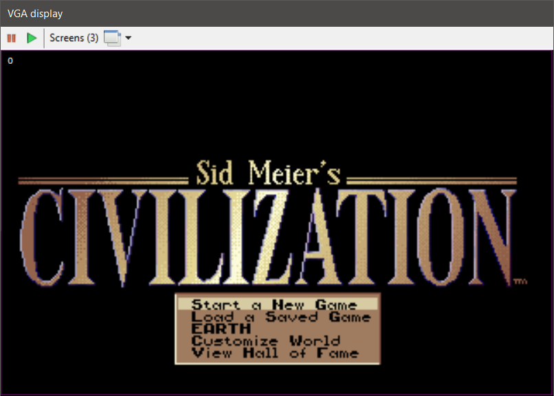
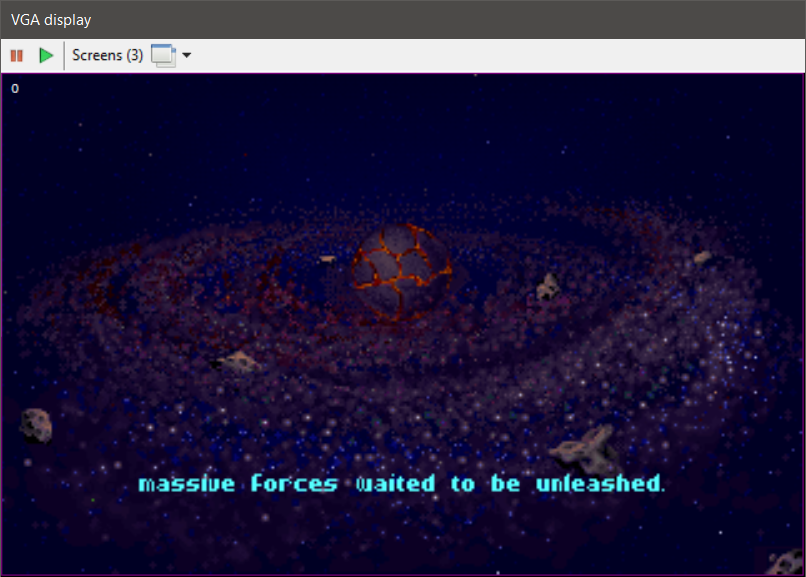
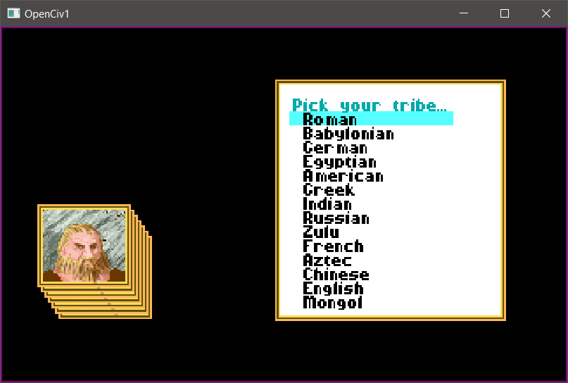
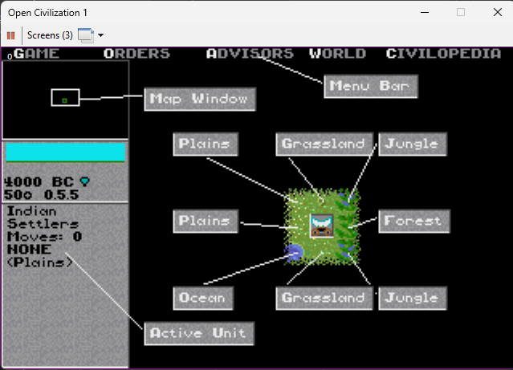
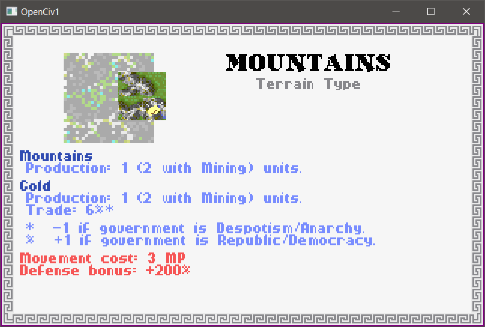
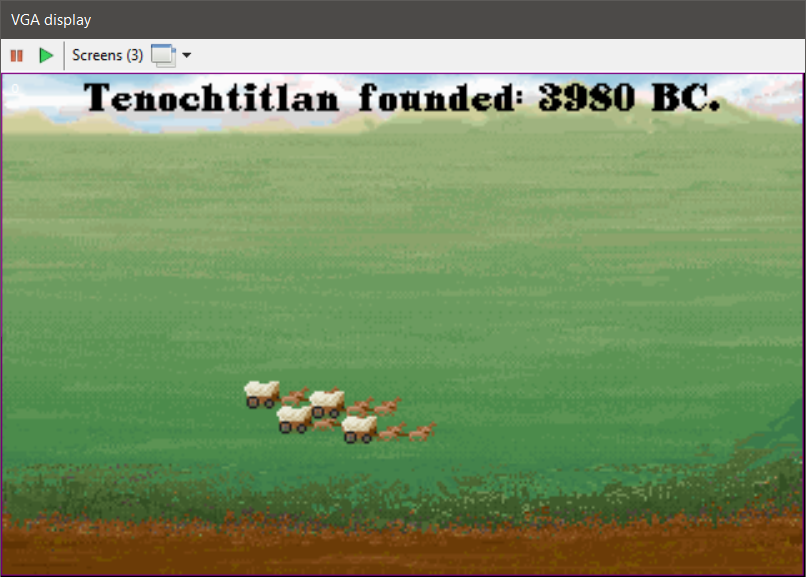
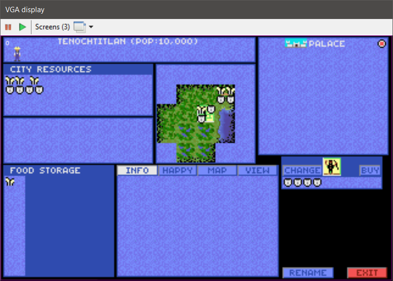
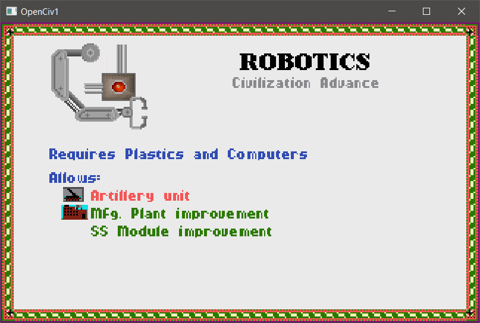
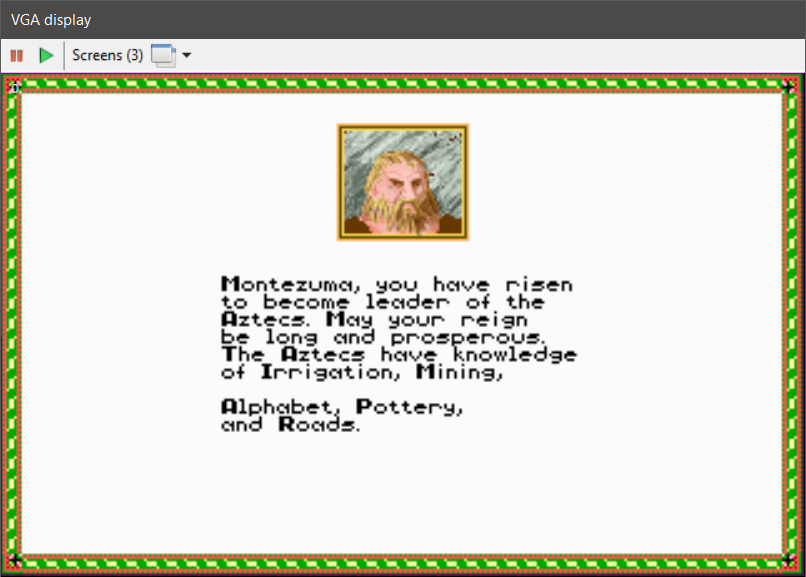
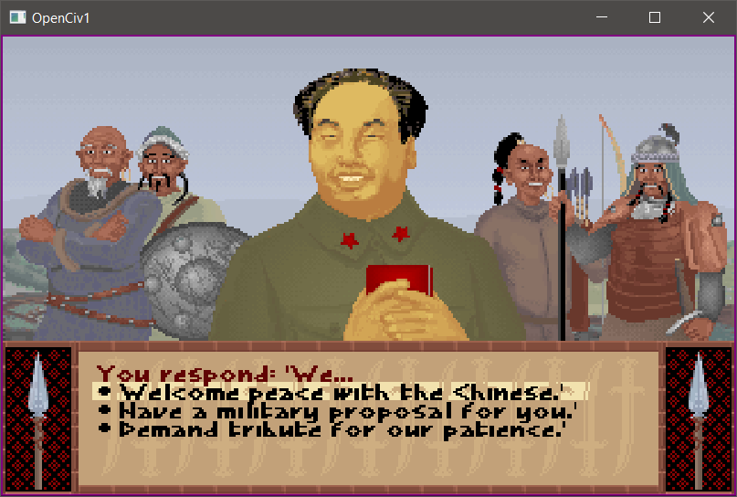
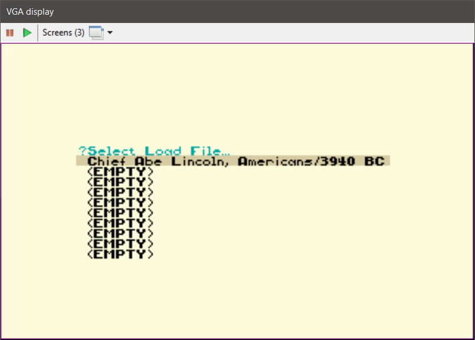
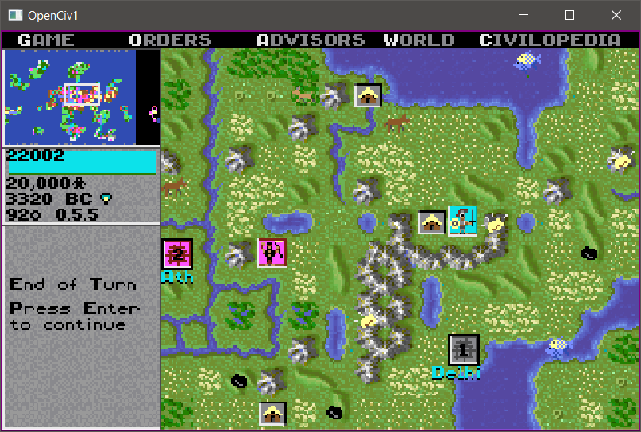
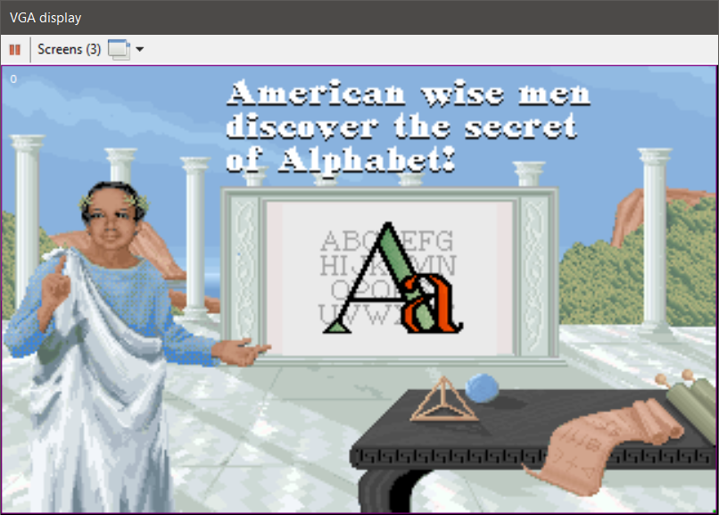
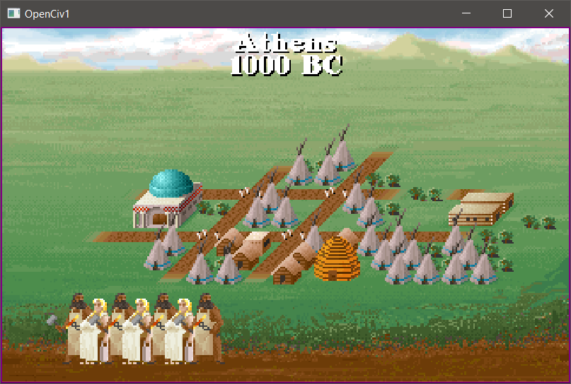

